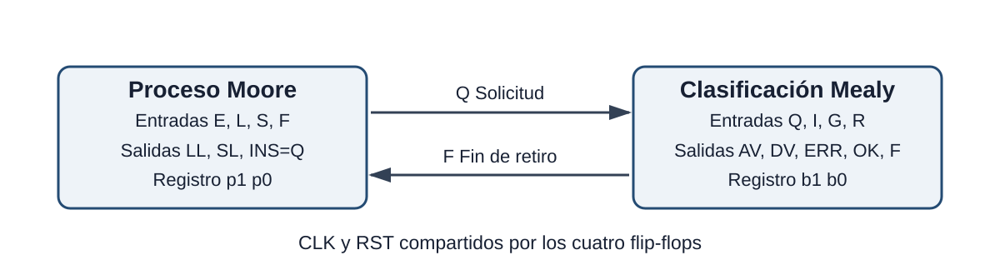
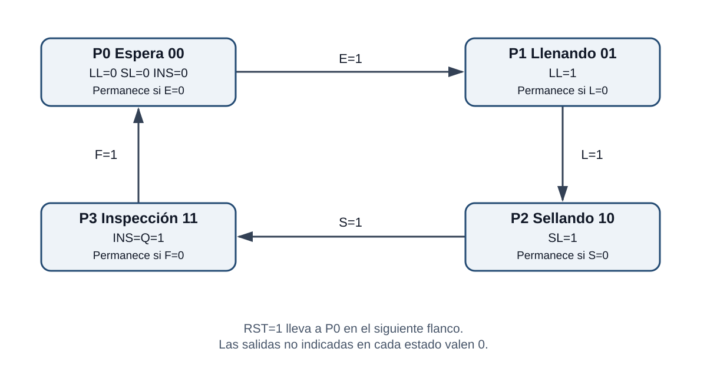
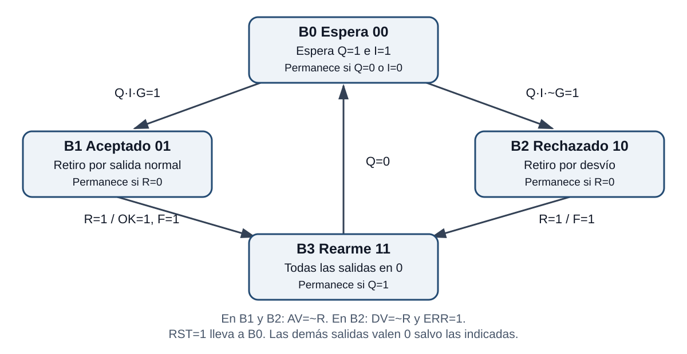

# Sistema automático de llenado, sellado e inspección de envases

Proyecto de máquina de estados finitos para controlar una estación que procesa un envase a la vez. El sistema llena y sella el envase, inspecciona el sello y selecciona una ruta de aceptación o rechazo.

El diseño utiliza las dos arquitecturas solicitadas:

- **Moore:** controla las etapas del proceso: espera, llenado, sellado e inspección.
- **Mealy:** clasifica el envase y controla su retiro según el resultado de inspección y el sensor de salida.



## Archivos del repositorio

```text
.
├── README.md
├── src/
│   └── Envases.circ
├── docs/
│   └── Tablas_FSM_Envases.xlsx
├── diagramas/
│   ├── arquitectura.svg
│   ├── fsm_moore.svg
│   └── fsm_mealy.svg
└── pruebas/
    ├── Proceso_Moore.txt
    └── Clasificacion_Mealy.txt
```

## Requisitos

- [Logisim-evolution 4.1.0](https://github.com/logisim-evolution/logisim-evolution/releases/tag/v4.1.0)
- Microsoft Excel o una aplicación compatible para consultar las tablas.

## Cómo abrir y reiniciar el circuito

1. Abre Logisim-evolution.
2. Selecciona **Archivo → Abrir** y carga `src/Envases.circ`.
3. Abre el circuito `main` y selecciona la herramienta de la mano.
4. Deja `CLK=0` y pon las demás entradas en 0.
5. Pon `RST=1`, realiza un pulso de reloj y vuelve `RST=0`.

Un pulso manual consiste en cambiar `CLK` de **0 a 1 y luego a 0**. Los sensores deben modificarse mientras `CLK=0`.

## Entradas

| Señal | Función |
|---|---|
| `CLK` | Actualiza los cuatro biestables en el flanco ascendente. |
| `RST` | Lleva ambas FSM al estado `00` en el siguiente flanco ascendente. |
| `E` | Indica que hay un envase en la estación. |
| `L` | Indica que terminó el llenado. |
| `S` | Indica que terminó el sellado. |
| `I` | Indica que el resultado de inspección está disponible. |
| `G` | Resultado de calidad: `1` correcto y `0` defectuoso. Se interpreta cuando `I=1`. |
| `R` | Indica que el envase fue retirado completamente. |

## Salidas

| Señal | Función |
|---|---|
| `LL` | Activa el llenado. |
| `SL` | Activa el sellado. |
| `INS` / `Q` | Solicita la inspección del envase. |
| `AV` | Hace avanzar el envase hacia la salida seleccionada. |
| `DV` | Activa el desviador de rechazo. |
| `ERR` | Indica que el envase fue clasificado como defectuoso. |
| `OK` | Confirma el retiro de un producto válido. |
| `F` | Confirma que terminó el retiro y libera la estación. |

## FSM Moore: proceso principal

| Estado | Código | Acción | Condición de salida |
|---|---:|---|---|
| P0 | `00` | Esperar envase | `E=1` |
| P1 | `01` | Llenar, `LL=1` | `L=1` |
| P2 | `10` | Sellar, `SL=1` | `S=1` |
| P3 | `11` | Inspeccionar, `INS=1` | `F=1` |



Ecuaciones del siguiente estado:

```text
p1+ = P1·L + P2 + P3·~F
p0+ = P0·E + P1·~L + P2·S + P3·~F
```

## FSM Mealy: clasificación

| Estado | Código | Función |
|---|---:|---|
| B0 | `00` | Esperar el resultado de inspección. |
| B1 | `01` | Retirar un envase aceptado. |
| B2 | `10` | Retirar un envase rechazado. |
| B3 | `11` | Rearmar y esperar que `Q` vuelva a 0. |



Ecuaciones del siguiente estado:

```text
b1+ = B0·Q·I·~G + B1·R + B2 + B3·Q
b0+ = B0·Q·I·G  + B1 + B2·R + B3·Q
```

Salidas Mealy:

```text
AV = (B1 + B2)·~R
DV = B2·~R
ERR = B2
OK = B1·R
F = (B1 + B2)·R
```

`F` se realimenta hacia la entrada `F` de Moore para que el proceso vuelva automáticamente a P0 después del retiro. B3 evita que una solicitud de inspección que todavía está activa se interprete dos veces.

## Prueba de un envase correcto

Después del reinicio, aplica un pulso después de configurar cada fila:

| Paso | E | L | S | I | G | R | Resultado esperado |
|---|---:|---:|---:|---:|---:|---:|---|
| Llegada | 1 | 0 | 0 | 0 | 0 | 0 | `LL=1` |
| Fin de llenado | 1 | 1 | 0 | 0 | 0 | 0 | `SL=1` |
| Fin de sellado | 1 | 0 | 1 | 0 | 0 | 0 | `INS=1` |
| Inspección correcta | 1 | 0 | 0 | 1 | 1 | 0 | `AV=1`, `DV=0` |
| Retiro | 0 | 0 | 0 | 0 | 0 | 1 | Antes del pulso: `F=1`, `OK=1`, `AV=0` |
| Rearme | 0 | 0 | 0 | 0 | 0 | 0 | Todas las salidas en 0 |

## Prueba de un envase defectuoso

Repite la secuencia anterior usando `I=1` y `G=0` durante la inspección. Deben activarse `AV=1`, `DV=1` y `ERR=1`. Al poner `R=1`, `AV` y `DV` bajan, `F` sube y `OK` permanece en 0.

## Verificación

El circuito fue probado con Logisim-evolution 4.1.0:

| Prueba | Casos correctos | Fallos |
|---|---:|---:|
| Proceso Moore | 896 | 0 |
| Clasificación Mealy | 768 | 0 |
| **Total** | **1664** | **0** |

Los archivos de `pruebas/` permiten comprobar por separado los bloques Moore y Mealy con la herramienta de vectores de prueba de Logisim. Además, el funcionamiento completo se verificó manualmente con un envase correcto y otro defectuoso.

## Video

**Video:** pendiente de publicación.

## Autor

Carlos Zuleta — Proyecto parcial 2 de Diseño Digital y Arquitectura de Computadores.
